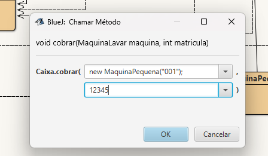
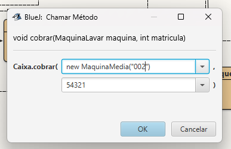
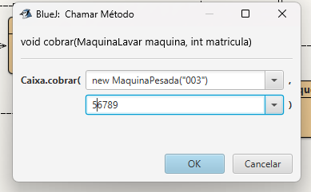
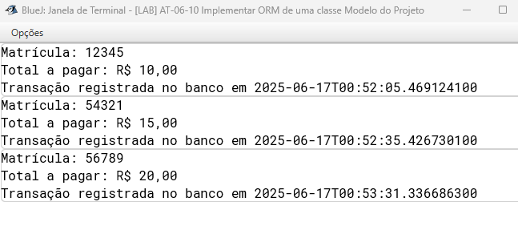
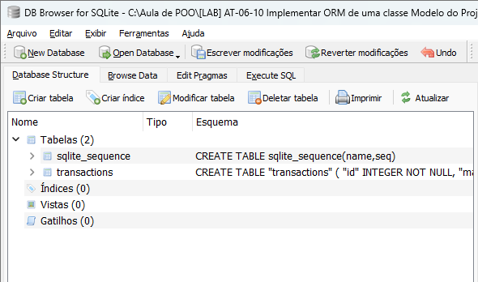
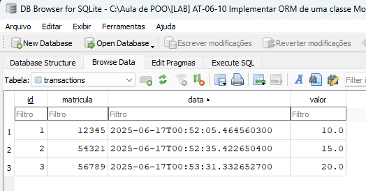

# Implementando ORM de uma classe Modelo do Projeto

A classe escolhida do projeto foi a classe Caixa, responsável pelas transações e valores referentes a cada tipo de máquina(Pequena, Média ou Pesada):

Teste de conexão da classe Database ao Banco de Dados:

Teste de conexão da classe TransactionRepository ao Banco de Dados:

Cadastro de uma Maquina Pequena, Media e Pesada no Banco de Dados
* Maquina Pequena:

* MaquinaMedia:

* Maquina Pesada:

Confirmação de Registro de Transações de cada máquina no Banco de Dados:

Tabelaa Iniciaia criadas no DB Browser:

Tabela de dados Preenchida no DB Browser:

