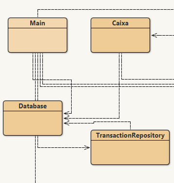
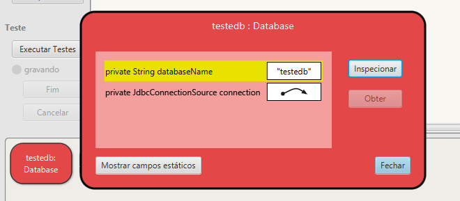

# Implementando ORM de uma classe Modelo do Projeto

A classe escolhida do projeto foi a classe Caixa, responsável pelas transações e valores referentes a cada máquina(Pequena, Média ou Pesada):

Teste de conexão da classe Database ao Banco de Dados:

Teste de conexão da classe TransactionRepository ao Banco de Dados:

